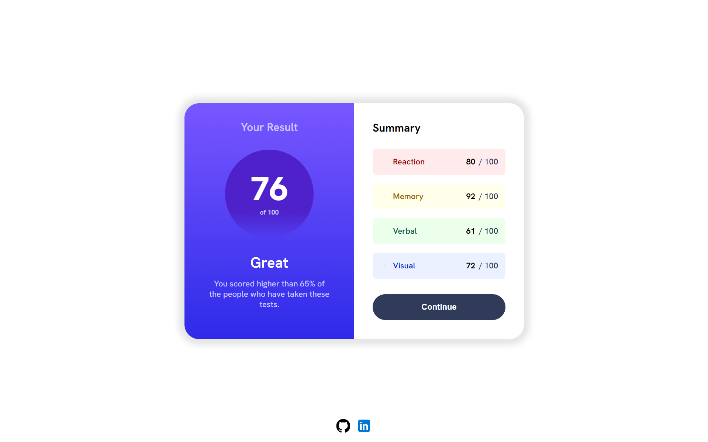

# Results summary component



## Description

this component is used to display the results summary

## Technologies

- HTML
- CSS
- JavaScript
- batch

## How to use

- Clone the repository

```bash
git clone https://github.com/AhmedHanye/Results-Summary-Component.git
```

- Open the `index.html` file in your browser
